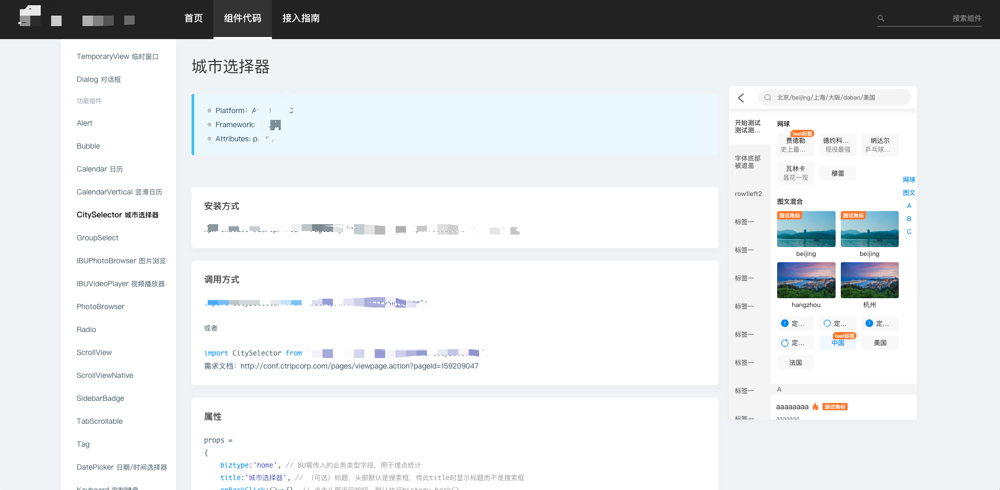

# 实现一个简易React UI组件文档小工具

>  以下示例代码，可能包含多个文件代码，有点乱。 <br/>
>  脚手架构建用到了umi/af-webpack，文档布局样式用到了vant-ui。


## 梳理思路

- 实现一个通用脚手架，完成初始化项目，构建，发布组件文档。
- 脚手架的构建环节选用webpack，因为文档站点其实也是一个应用
- 组件需要具备预览功能，所以我们可以采取MPA的方式多入口打包
- 约定一个配置文件，里面主要配置文档的header、sideBar等，这部分也相当于配置了route
- 使用require.context加载用户目录下的md文件

## 效果图



## 开始实现

### 脚手架

#### 初始化
简单来讲就是cli内置一个template,可以选择是多个固定的，也可以单个通过init阶段配合选择项来动态生成个性化的初始模版，技术方案：inquirer + ejs或mustache

示例代码：
```js
async function init() {
  try {
    const answers = await inquirer.prompt(questions);

    const { projectName, platform, framework, attributes, bu, site } = answers;

    const templateRoot = path.join(__dirname, './boilerplate');

    const projectPath = path.join(cwd, projectName);

    await fse.copySync(templateRoot, projectPath, {
      filter: (file) => {
        const reg = /\.(tpl|ejs)$/ig;
        if (reg.test(file)) {
          return false;
        }
        return true;
      },
    });

    const code = fse.readFileSync(path.join(templateRoot, 'config.ejs'), {
      encoding: 'utf8',
    });

    await fse.writeFileSync(
      path.join(projectPath, 'config.js'),
      ejs.render(
        code,
        {
          projectName,
          platform,
          framework,
          attributes,
          bu,
          site,
        },
      ),
      {
        encoding: 'utf8',
      },
    );
    signale.success(chalk.cyan('创建项目成功！'));
    signale.info(chalk.cyan('npm run dev 开始工作吧!！😝'));
  } catch (error) {
    signale.error(error);
  }
}
```

#### 构建

脚手架中构建功能使用的是webpack，为了快速实现，所以直接采用并二次封装了umi内部的af-webpack的配置方案👍，当执行脚手架构建命令时，将本地的配置的相关参数透传给af-webpack即可，基本上一路绿灯。

- 配置多入口
```js
  entry: {
    'docs': [
      webpackHotDevClientPath, // 开发态hmr
      path.join(paths.absTmpDirPath, './docs/index.js'),
    ],
    'preview': [
      webpackHotDevClientPath,
      path.join(paths.absTmpDirPath, './preview/index.js'),
    ],
  }
```

- markdown解析

为了将markdown也当成一个组件输出，保留正常markdown-loader的功能，稍微定制化一下loader，这样可以直接将front-matter配置的信息呈现在页面上，如下：

```js
function transformToComponent(content, fm) {
  const { attributes } = fm;
  return `
    import React, { Component, Fragment } from 'react';

    export default class extends Component {

      state = {
        html: '${escape(content)}',
        attr: ${JSON.stringify(attributes)},
      }

      render() {
        const { html, attr } = this.state;
        const { platform, framework, attributes } = attr;
        return (
          <Fragment>
            {/*<section>
              <blockquote>
                <ul>
                  {platform && <li>Platform: {platform}</li>}
                  {framework && <li>Framework: {framework}</li>}
                  {attributes && <li>Attributes: {attributes}</li>}
                </ul>
              </blockquote>
            </section>*/}
            <section dangerouslySetInnerHTML={{ __html: unescape(html) }} />
          </Fragment>
        )
      }
    }
  `;
}

```

#### 发布

todo...


### 约定配置文件， 示例：

```js
module.exports = {
  header: {
    logo: {
      image: 'https://www.baidu.com',
      title: 'YufPress',
      href: '#/'
    },
  },
  // siderBar即route，会解析成react-router的子route
  sideBar: {
    name: 'UI',
    groups: [
      {
        groupName: '基础组件',
        list: [
          {
            disabled:  false,
            enablePreview: true, // 是否开启预览
            path: '/Alert', // 路径（即docs文件夹下的路径
            title: 'Alert',
          },
        ]
      }
    ]
  },
};

```

构建时处理方式，示例代码如下：

```js
// 收集文件
const docsMap = {};
const req = require.context('@root/docs', true, /\.md$/);

req.keys().forEach((key) => {
  docsMap[key] = req(key);
});

// 生成route

import { sideBar } from '@root/config';
const routes = []; // 传给react-router生成路由

sideBar.groups.forEach((group) => {
  group.list.forEach((page) => {
    addRoute(page);
  });
});


// addRoute

function addRoute(page) {
  const { path, title, disabled = false } = page;
  if (path) {
    // 兼容处理
    const module =
      componentMap[`.${path}/readme.md`] ||
      componentMap[`.${path}/README.md`] ||
      componentMap[`.${path}.md`] ||
      {};

    if (!disabled) {
      routes.push({
        component: module.default || None,
        name: `${path}`,
        path: `/${path}`,
        title,
      });
    }

  }
}

```

**同理，处理预览组件(\.(j|t)sx?)这样的文件的方式一样**

## 总结

开始陷入思考，我为什么要写这个？好像没啥好写的。下篇准备写我是如何在此基础上实现插件机制的。
